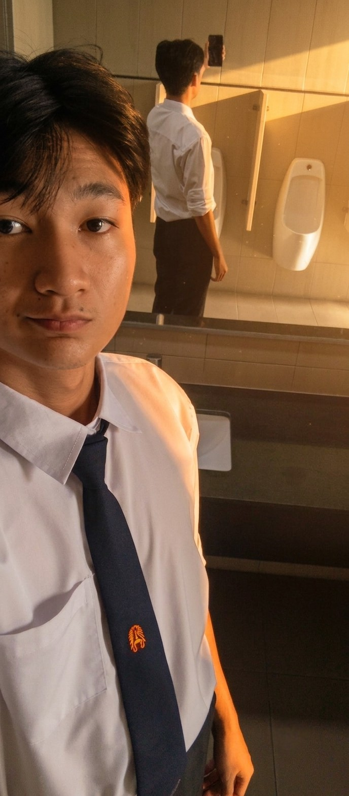

# GROUP : RainbowPipo
ชื่อกลุ่มได้มาจากการพูดคุยกันและอยากได้อะไรที่เกี่ยวกับของกินและเป็นของหวานจึงเสนอปีโป้สายรุ้งที่เป็นของในตำนานที่เคยวางขายสมาชิกก็เห็นพ้องตรงกัน

## สมาชิกในทีม

- ชื่อ : อะริยะทรัพย์ โพธิ์กระสังข์   
    รหัสนักศึกษา : 69130500075

- ชื่อ : สารัช มหาชีวสกุล\
    รหัสนักศึกษา : 69130500070
- ชื่อ : ณัฐดนัย สุวรรณหงษ์\
    รหัสนักศึกษา : 69130500105
- ชื่อ : ปิติศักดิ์ ช่างเกวียน\
    รหัสนักศึกษา : 69130500109
- ชื่อ : คิรากร พรสิริสุธานนท์\
    รหัสนักศึกษา : 69130500103
- ชื่อ : ชลฑิต จิตสมนึก\
    รหัสนักศึกษา : 69130500121

---

**- ชื่อจริง/ชื่อเล่น/อายุ -** 🙂\
ชื่อ : สารัช มหาชีวสกุล - ชื่อเล่น : ไปป์ - อายุ : 19 ปี

**- Social Media -** 📱
IG : [Sarachy_Pipe](https://www.instagram.com/sarachy_pipe/)

**- เวลาว่างชอบทำอะไร แล้วเสน่ห์ของมันคืออะไร? -** 👍\
ดูการแข่งขันเกมแนว Moba เพราะชอบการนั่งวิเคราะห์ว่าตัวละครไหนเก่งยังไง ชนะ/แพ้ทางตัวละครไหน ทีมไหนมีแผนการเล่นยังไง แล้วนักแข่งคนไหนเล่นตัวละครไหนเก่ง

**- มีอะไรที่ไม่ชอบทำเลย เพราะอะไร? -** 👎\
การต้องคุยกับคนที่ไร้เหตุผล เพราะต่อให้เราจะอธิบายไปมากแค่ไหน เขาก็ไม่ฟังและยึดถือแต่ความถูกต้องของตัวเอง

**- อะไรทำให้ตัดสินใจมาเรียนที่ มจธ.? -** 🤔\
เป็นมหาลัยที่มีชื่อเสียงด้านเทคโนโลยีอันดับต้นๆ แล้วก็พี่ชายเรียนอยู่ที่มหาลัยนี้ด้วย เลยคิดว่าน่าจะปรับตัวได้ง่ายขึ้น

**- เข้ามาเรียนจริงแล้ว ต่างจากที่คิดไว้ยังไงบ้าง? -** 😮\
รู้สึกว่ามีอุปกรณ์ที่ทันสมัยจำนวนเยอะกว่าที่คิด และบรรยากาศร่มรื่น มีต้นไม้เยอะมาก

**- อีก 3–5 ปีข้างหน้า มองตัวเองไว้ยังไง อยากทำอะไร? -** 🎯\
อยากทำงานด้าน Data analyst หรืองานอื่นๆที่เป็นแนวการวิเคราะห์ข้อมูล สามารถสื่อสารภาษาอังกฤษได้ดีขึ้นกว่าเดิม และใช้งาน Ai เป็นเครื่องมือได้อย่างคล่องแคล่ว

**- อะไรคือแรงบันดาลใจที่ทำให้ อยากไปให้ถึงจุดนั้น? -** 💡\
รู้สึกชอบในการสังเกตและเก็บข้อมูล และชอบการนำเสนอการวิเคราะห์ข้อมูลให้ผู้อื่นได้รับฟัง และอยากมีเงินไปเที่ยวต่างประเทศ

---

**- ผู้สัมภาษณ์ -**\
ชื่อ : อะริยะทรัพย์ โพธิ์กระสังข์\
รหัสนักศึกษา : 69130500075

---

 **- ชื่อจริง / ชื่อเล่น / อายุ - 👤**\
 ชื่อ : ณัฐดนัย สุวรรณหงษ์ - ชื่อเล่น : ณัฐ - อายุ : 18

**- Social Media - 🌐**\
IG : [kujgang_](https://www.instagram.com/kujgang_/)

**- เวลาว่างชอบทำอะไร แล้วเสน่ห์ของมันคืออะไร? - 🎵**\
 ชอบฟังเพลงเสน่ห์ก็เวลาฟังแล้วมันทำให้รู้สึกสงบคิดอะไรได้หลายๆอย่าง

**- มีอะไรที่ไม่ชอบทำเลย เพราะอะไร? - 🚫**\
  ไม่ชอบไปไหนหรือทำอะไรโดยไม่มีแผนล่วงหน้า\
  เพราะถ้าไม่รู้ว่าจะทำอะไรเวลาเราไปทำอะไรที่ไหนมันก็จะเสียเวลาไปเปล่าๆโดยที่ไม่มีประโยชน์อะไร

**- อะไรทำให้ตัดสินใจมาเรียนที่ มจธ.? - 🤔**\
  หลักๆเลยก็เพราะว่าใกล้บ้านไม่เหมือนมอ.อื่นที่อยู่ไกลแล้วก็มจธ.เป็นมอ.ที่ดีและมีสังคมที่ดี มีห่านด้วย

**- เข้ามาเรียนจริงแล้ว ต่างจากที่คิดไว้ยังไงบ้าง? - ⚠️**\
  ตอนแรกก็นึกว่าตอนเข้ามาเรียนจะมีแบบว่าเขียนโค้ดไรงี้ แต่ตอนนี้ยังไม่ได้แตะเลย

**- อีก 3–5 ปีข้างหน้า มองตัวเองไว้ยังไง อยากทำอะไร? - 🎯**\
   ก็อยากจะเป็นคนที่เก่ง เรียนจบได้คะแนนที่ดีแล้วก็มีงานทำด้วย

**- อะไรคือแรงบันดาลใจที่ทำให้ อยากไปให้ถึงจุดนั้น? - 💡**\
 ก็เรื่องเงินนี้แหละ พอโตไปจะได้ใช้ชีวิตได้ง่ายไม่ต้องลำบากมากนัก
****
### - ผู้สัมภาษณ์ - 🎬 🎥 🔴 ▶
*ชื่อ : สารัช มหาชีวสกุล* 

*รหัสนักศึกษา : 69130500070* 
****

  

**- Social Media - 🌐**\
IG : [Uioopluem_](https://www.instagram.com/uioopluem_/)

TikTok : [ผมคือไค](https://www.tiktok.com/@ks1523_ch)

**- ชื่อจริง / ชื่อเล่น / อายุ - 👤**
- นายปิติศักดิ์ ช่างเกวียน
-ปลื้ม
-อายุ 18

**- เวลาว่างชอบทำอะไร แล้วเสน่ห์ของมันคืออะไร? - 🎵**

    -สตรีมเกม เสน่ห์ของมันคือได้ปล่อยพลัง สร้างความบันเทิง และเป็นตัวเองเต็มที่
    -เล่นเกม เสน่ห์ของมันคือสวมบทบาท เข้าไปดำดิ่งในโลกที่ไม่เคยไป
    -ฟังเพลง เสน่ห์ของมันคือ สร้างบรรยากาศและช่วยปรับอารมณ์และปลดปล่อยความรู้สึก
    -แต่งเพลง เสน่ห์ของมันคือสนุกกับการร้อยเรียงคำ จังหวะ เปลี่ยนอารมณ์ ความคิด และเรื่องราวให้เป็นศิลปะ

**- มีอะไรที่ไม่ชอบทำเลย เพราะอะไร? - 🚫**
- การที่ไม่ทำอะไรเลย เพราะบางครั้งการอยู่คนเดียว ไม่ปลดปล่อยอะไรเลย มันรู้สึกเครียด และเบื่อ

**- อะไรทำให้ตัดสินใจมาเรียนที่ มจธ.? - 🤔**
- เพราะส่วนตัวของผมอยากเข้าศึกษาต่อในพระจอมเกล้าอยู่แล้ว และผมก็มีความชื่นชอบในด้านคอมพิวเตอร์กับเทคโนโลยีอยู่ด้วย
พอได้ศึกษาเกี่ยวกับมหาลัยแล้ว เห็นว่า มจธ มีความเด่นในด้านนี้ จึงตัดสินใจที่จะศึกษาต่อที่นี่
ในคณะเทคโนโลยีสารสนเทศ สาขาเทคโนโลยีสารสนเทศ เพราะด้วยความชอบในคอมพิวเตอร์

**- เข้ามาเรียนจริงแล้ว ต่างจากที่คิดไว้ยังไงบ้าง? - ⚠️**

    -คิดว่ายาก/ง่าย ต่างจากที่ติดไว้อยู่พอควร แล้วต้องปรับตัวค่อนข้างที่จะเยอะ ทั้งในด้านทักษะภาษา ทักษะทางคอมพิวเตอร์
    และค่าใช้จ่ายค่อนข้างที่จะเยอะ

**- อีก 3–5 ปีข้างหน้า มองตัวเองไว้ยังไง อยากทำอะไร? - 🎯**

    -ผมอยากที่จะมีเกมเป็นของตัวเอง และอยากจะพัฒนาเกมหรือทำงานในบริษัทเทค หรือบริษัทใหญ่โต เพื่ออาชีพและการเงินที่มั่นคงให้ตัวเองและครอบครัวในอนาคตก่อน
**- อะไรคือแรงบันดาลใจที่ทำให้ อยากไปให้ถึงจุดนั้น? - 💡**

    -อยากเห็นครอบครัวของตัวเองหลุดพ้นจากความยากจน ความลำบาก

****
### - ผู้สัมภาษณ์ - 🎬 🎥 🔴 ▶
*ชื่อ : ณัฐดนัย สุวรรณหงษ์*

*รหัสนักศึกษา : 69130500105*
****

**- ชื่อจริง / ชื่อเล่น / อายุ -** 🫡   
 ชื่อ :คิรากร พรสิริสุธานนท์ - ชื่อเล่น : เปรม - อายุ : 18

 **- Social Media -**📷\
 IG : [ipram_e](https://www.instagram.com/ipram_e/)

**- เวลาว่างชอบทำอะไร แล้วเสน่ห์ของมันคืออะไร? -**🎮\
 ชอบเล่นเกมเสน่ห์ของมันคือเนื้อเรื่องกับบรรยากาศแล้วก็ความท้าทายชอบเล่นเกมที่มันยากๆ

**-มีอะไรที่ไม่ชอบทำเลย เพราะอะไร? -**🃏\
 การพนัน เพราะคนใกล้ตัวส่วนใหญ่เสียผู้เสียคนเพราะแพ้พนันมาเยอะแล้วตัวเองก็ไม่อยากจะไปเป็นแบบคนพวกนั้น

**-อะไรทำให้ตัดสินใจมาเรียนที่ มจธ.?-**🫠\
 อยู่ใกล้บ้านด้วยแล้วก็ช่วยพ่อแม่ประหยัดค่าใช้จ่ายไม่ต้องลำบากไปอยู่หอ
 เป็นสิ่งที่อยากเรียนด้วยก็เลยมาเรียนที่นี้

**-เข้ามาเรียนจริงแล้ว ต่างจากที่คิดไว้ยังไงบ้าง?-**😨\
 หาเพื่อนยากกว่าที่คิดปกติเป็นคนพูดน้อยอยู่แล้ว\
 แถมคนอืนๆก็เหมือนจะมาเป็นกลุ่มๆด้วยต่างจากเราที่มาแค่คนเดียว

**-อีก 5 ปีข้างหน้า มองตัวเองไว้ยังไง อยากทำอะไร?**🫤\
 มีงานทำแล้วก็อาจจะเรียนต่อเพราะตัวเองเป็นคนชอบเรียนอยากจะลองอะไรอย่างอื่นนอกจากคอมบ้าง\
 แล้วก็มีตังค์เยอะๆ

**-อะไรคือแรงบรรดาลใจที่ทำให้ อยากไปถึงจุดนั้น?**😲\
อยากมีคอมแรงๆเอาไว้เล่นเกมแล้วก็การเติมเกมเสียเงินค่อนข้างเยอะ

---
**- ผู้สัมภาษณ์ -**
#### ชื่อ:ปิติศักดิ์ ช่างเกวียน
#### รหัสนักศึกษา: 69130500109

---

**-ชื่อ ชื่อเล่น และอายุเท่าไหร่?-**\
ชื่อ:อะริยะทรัพย์ โพธิ์กระสังข์ ชื่อเล่น:ดิว อายุ:18 ปี

**- Social Media -**\
IG : [square_door](https://www.instagram.com/square_door/)

**- เวลาว่างชอบทำอะไร แล้วเสน่ห์ของมันคืออะไร? -**\
เวลาว่างชอบนอนฟังเพลงเสน่ห์ของมันคือช่วยทำให้ผ่อนคลายและช่วยทำให้คิดอะไรได้สงบ 😌

**- มีอะไรที่ไม่ชอบทำเลย เพราะอะไร? -**\
การที่ต้องไปเล่นกับเด็กที่ไม่รู้เรื่องหรือไม่รู้จักความเพราะทำให้เสียสุขภาพจิตมาก

**- อะไรทำให้ตัดสินใจมาเรียนที่ มจธ.? -**\
หลักสูตรตรงกับสิ่งที่สนใจจริงๆและสามารถไปปรับใช้ได้
จริงและสภาพแวดล้อมการเรียนรู้

**- เข้ามาเรียนจริงแล้ว ต่างจากที่คิดไว้ยังไงบ้าง? -**\
หาของกินง่ายกว่าที่คิด ก่อนเข้ามานึกว่าจะหาข้าวกินยาก

**- อีก 3–5 ปีข้างหน้า มองตัวเองไว้ยังไง อยากทำอะไร? -**\
มีความเป็นมืออาชีพและความรับผิดชอบมากขึ้น เริ่มต้นไปหาประสบการณ์จากบริษัทต่างๆหลังจากนั้นอยากออกมาจัดการงานเองเชิงฟรีแลนซ์วางระบบการทำงานและทำให้ตัวเองมีเวลาใช้กับครอบครัว

**- อะไรคือแรงบันดาลใจที่ทำให้ อยากไปให้ถึงจุดนั้น? -**\
อยากซื้อ Toyato GT86 มาขับด้วยเงินของตัวเอง 😎

---
**- ผู้สัมภาษณ์ -**\
ชื่อ:คิรากร พรสิริสุธานนท์\
รหัสนักศึกษา:69130500103
****

### - ผู้สัมภาษณ์ - 🎬 🎥 🔴 ▶
*ชื่อ : ณัฐดนัย สุวรรณหงษ์*

*รหัสนักศึกษา : 69130500105*
****

**- ชื่อจริง / ชื่อเล่น / อายุ -** 🫡   
 ชื่อ :ชลฑิต จิตสมนึก - ชื่อเล่น : โฟล์ค - อายุ : 19

 **- Social Media -**📷\
 IG : [sierrableuu](https://www.instagram.com/sierrableuu/)

**- เวลาว่างชอบทำอะไร แล้วเสน่ห์ของมันคืออะไร? -**🎮\
 -ชอบเล่นเกมเสน่ห์ของมันคือความสนุกเเละได้ผ่อนคลาย 
 -ชอบฟังเพลงทำให้ผ่อนคลายเเละสงบ 
 -ชอบเขียนบันทึกเเละชอบอ่านหนังสือเพราะมันทำให้ผมหยุดฟุ้งซ่าน

**-มีอะไรที่ไม่ชอบทำเลย เพราะอะไร? -**🃏\
 -การคบกับคน toxic เพราะมันทำให้เราเป็นเเบบนั้นไปด้วย

**-อะไรทำให้ตัดสินใจมาเรียนที่ มจธ.?-**🫠\
 -หลักสูตรน่าสนใจปรับเปลี่ยนอยู่ตลอดเเละที่บ้านอยากให้เรียน 
 -อยากเรียนด้านไอที
 

**-เข้ามาเรียนจริงแล้ว ต่างจากที่คิดไว้ยังไงบ้าง?-**😨\
 -หาเพื่อนง่ายเเต่หาคนที่สนิทยาก 
 -บุคลากรบางคนขี้วีน 
 -ไม่คิดว่าจะมีระบบบันทึกการเรียนย้อนหลังด้วย ช่วยได้เยอะมาก

**-อีก 5 ปีข้างหน้า มองตัวเองไว้ยังไง อยากทำอะไร?**🫤\
 -ได้ทำในสิ่งที่รักเเล้วมีความสุข 
 -มีการเงินมั่นคงไม่ต้องรวยล้นฟ้าเเค่ไม่ทำให้ตัวเองเเละคนที่รักลำบากก็พอ 
 -เป็นคนที่ปล่อยวางได้มากขึ้น 
 -เป็นคนที่มีวินัยเเละความซื่อสัตย์ต่อตัวเอง

**-อะไรคือแรงบรรดาลใจที่ทำให้ อยากไปถึงจุดนั้น?**😲\
 -เพื่อตัวเอง อยากรู้ว่าหากตัวเองไปถึงจุดนั้นเเล้วจะเป็นยังไง

---